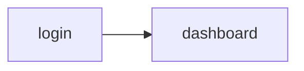

# Ordino agent memory

> Persistent locator cache for this project. Committed to git.

## Index

| URL | Page Object | Last Validated | Status | Hash (short) |
|---|---|---|---|---|
| /web/index.php/auth/login | LoginPage | 2026-05-13 | ✅ Working | smoke |
| /web/index.php/dashboard/index | DashboardPage | 2026-05-13 | ✅ Working | smoke |

---

## Navigation graph

```yaml
nav:
  login: /web/index.php/auth/login
  dashboard: /web/index.php/dashboard/index
```



---

## Entities

```yaml
entities: {}
```

---

## Test data registry

```yaml
test_data:
  admin_user: src/data/login/users.json#admin
```

---

## Feature index

```yaml
features:
  login: features/login.spec.ts
```

---

## Facts

```yaml
facts:
  - OrangeHRM opensource demo uses name=username and name=password fields.
```
